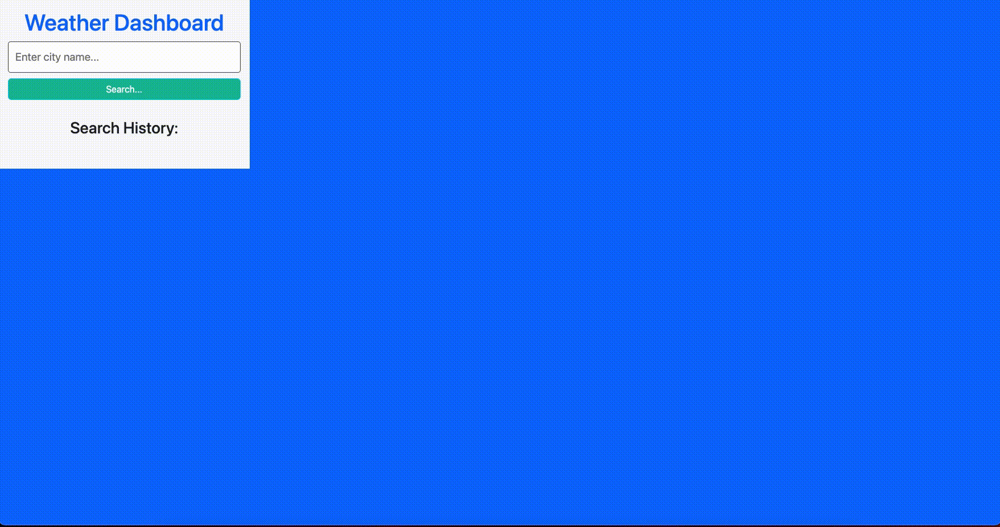

# weather-dashboard-build
A simple weather dashboard that searches by city and holds five cities in memory. 

## Project Description

The purpose of this project was to create a dashboard that allows a user to search for current and future weather forecasts of a city by searching by name. A history feature is included to allow users to quickly navigate back to viewed cities. 

## Installation

No installation necessary. 

## Visual

## Usage

Public use for informational purposes only. 

## Link

[Work Day Scheduler](https://softpoachedeggs.github.io/refactor-daily-planner/)

## License

[MIT](https://choosealicense.com/licenses/mit/)
